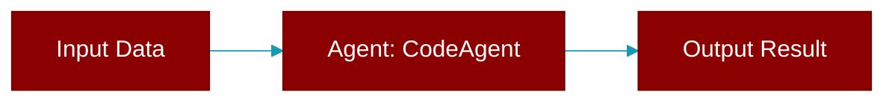

# CodeAgent

> Defined in the [**agents**](../modules/agents) module.

<Badge color="orange">Rust AI Agent SDK</Badge>

A specialized agent for code generation and execution.



## Fields

| Name | Type | Description |
|------|------|-------------|
| `name` | `String` | Agent name |
| `model` | `String` | LLM model |
| `config` | `CodeConfig` | Code configuration |
| `instructions` | `Option&lt;String&gt;` | System instructions |
| `verbose` | `bool` | Verbose output |

## Methods

### `new`

```rust
fn new() -> CodeAgentBuilder
```

Create a new CodeAgent builder

### `name`

```rust
fn name(&self) -> &str
```

Get agent name

### `generate`

```rust
fn generate(&self, description: &str) -> Result<String>
```

Generate code from a description (placeholder)

**Parameters:**

| Name | Type |
|------|------|
| `description` | `&str` |

### `execute`

```rust
fn execute(&self, _code: &str) -> Result<CodeExecutionResult>
```

Execute code (placeholder - would require sandbox)

**Parameters:**

| Name | Type |
|------|------|
| `_code` | `&str` |

### `review`

```rust
fn review(&self, code: &str) -> Result<String>
```

Review code (placeholder)

**Parameters:**

| Name | Type |
|------|------|
| `code` | `&str` |


## Source

<Card title="View on GitHub" icon="github" href="https://github.com/MervinPraison/PraisonAI/blob/main/src/praisonai-rust/praisonai/src/agents/mod.rs#L776">
  `praisonai/src/agents/mod.rs` at line 776
</Card>


---

## Related Documentation

<CardGroup cols={2}>
  <Card title="Agents Concept" icon="robot" href="/docs/concepts/agents" />
  <Card title="Single Agent Guide" icon="book-open" href="/docs/guides/single-agent" />
  <Card title="Multi-Agent Guide" icon="users" href="/docs/guides/multi-agent" />
  <Card title="Agent Configuration" icon="gear" href="/docs/configuration/agent-config" />
  <Card title="Auto Agents" icon="wand-magic-sparkles" href="/docs/features/autoagents" />
</CardGroup>
