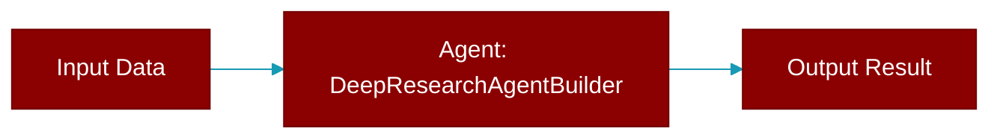

# DeepResearchAgentBuilder

> Defined in the [**agents**](../modules/agents) module.

<Badge color="orange">Rust AI Agent SDK</Badge>

Builder for DeepResearchAgent.



## Fields

| Name | Type | Description |
|------|------|-------------|
| `name` | `Option&lt;String&gt;` | - |
| `model` | `Option&lt;String&gt;` | - |
| `instructions` | `Option&lt;String&gt;` | - |
| `config` | `DeepResearchConfig` | - |
| `verbose` | `bool` | - |

## Methods

### `name`

```rust
fn name(mut self, name: impl Into<String>) -> Self
```

Set the agent name

**Parameters:**

| Name | Type |
|------|------|
| `name` | `impl Into&lt;String&gt;` |

### `model`

```rust
fn model(mut self, model: impl Into<String>) -> Self
```

Set the model

**Parameters:**

| Name | Type |
|------|------|
| `model` | `impl Into&lt;String&gt;` |

### `instructions`

```rust
fn instructions(mut self, instructions: impl Into<String>) -> Self
```

Set instructions

**Parameters:**

| Name | Type |
|------|------|
| `instructions` | `impl Into&lt;String&gt;` |

### `config`

```rust
fn config(mut self, config: DeepResearchConfig) -> Self
```

Set config

**Parameters:**

| Name | Type |
|------|------|
| `config` | `DeepResearchConfig` |

### `build`

```rust
fn build(self) -> Result<DeepResearchAgent>
```

Build the agent


## Source

<Card title="View on GitHub" icon="github" href="https://github.com/MervinPraison/PraisonAI/blob/main/src/praisonai-rust/praisonai/src/agents/mod.rs#L1174">
  `praisonai/src/agents/mod.rs` at line 1174
</Card>


---

## Related Documentation

<CardGroup cols={2}>
  <Card title="Agents Concept" icon="robot" href="/docs/concepts/agents" />
  <Card title="Single Agent Guide" icon="book-open" href="/docs/guides/single-agent" />
  <Card title="Multi-Agent Guide" icon="users" href="/docs/guides/multi-agent" />
  <Card title="Agent Configuration" icon="gear" href="/docs/configuration/agent-config" />
  <Card title="Auto Agents" icon="wand-magic-sparkles" href="/docs/features/autoagents" />
</CardGroup>
