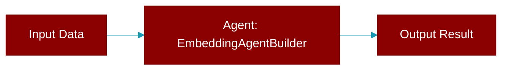

# EmbeddingAgentBuilder

> Defined in the [**embedding**](../modules/embedding) module.

<Badge color="orange">Rust AI Agent SDK</Badge>

Builder for EmbeddingAgent.



## Fields

| Name | Type | Description |
|------|------|-------------|
| `name` | `String` | - |
| `model` | `String` | - |
| `config` | `EmbeddingConfig` | - |
| `verbose` | `bool` | - |

## Methods

### `new`

```rust
fn new() -> Self
```

Create a new builder

### `name`

```rust
fn name(mut self, name: impl Into<String>) -> Self
```

Set agent name

**Parameters:**

| Name | Type |
|------|------|
| `name` | `impl Into&lt;String&gt;` |

### `model`

```rust
fn model(mut self, model: impl Into<String>) -> Self
```

Set model name

**Parameters:**

| Name | Type |
|------|------|
| `model` | `impl Into&lt;String&gt;` |

### `config`

```rust
fn config(mut self, config: EmbeddingConfig) -> Self
```

Set embedding config

**Parameters:**

| Name | Type |
|------|------|
| `config` | `EmbeddingConfig` |

### `verbose`

```rust
fn verbose(mut self, verbose: bool) -> Self
```

Set verbose mode

**Parameters:**

| Name | Type |
|------|------|
| `verbose` | `bool` |

### `api_key`

```rust
fn api_key(mut self, key: impl Into<String>) -> Self
```

Set API key

**Parameters:**

| Name | Type |
|------|------|
| `key` | `impl Into&lt;String&gt;` |

### `api_base`

```rust
fn api_base(mut self, url: impl Into<String>) -> Self
```

Set API base URL

**Parameters:**

| Name | Type |
|------|------|
| `url` | `impl Into&lt;String&gt;` |

### `build`

```rust
fn build(self) -> Result<EmbeddingAgent>
```

Build the EmbeddingAgent


## Source

<Card title="View on GitHub" icon="github" href="https://github.com/MervinPraison/PraisonAI/blob/main/src/praisonai-rust/praisonai/src/embedding/mod.rs#L144">
  `praisonai/src/embedding/mod.rs` at line 144
</Card>


---

## Related Documentation

<CardGroup cols={2}>
  <Card title="Rust Overview" icon="book-open" href="/docs/rust/overview" />
  <Card title="Rust Quickstart" icon="rocket" href="/docs/rust/quickstart" />
  <Card title="Rust Agent Guide" icon="robot" href="/docs/rust/agent" />
  <Card title="Rust Installation" icon="download" href="/docs/rust/installation" />
</CardGroup>
