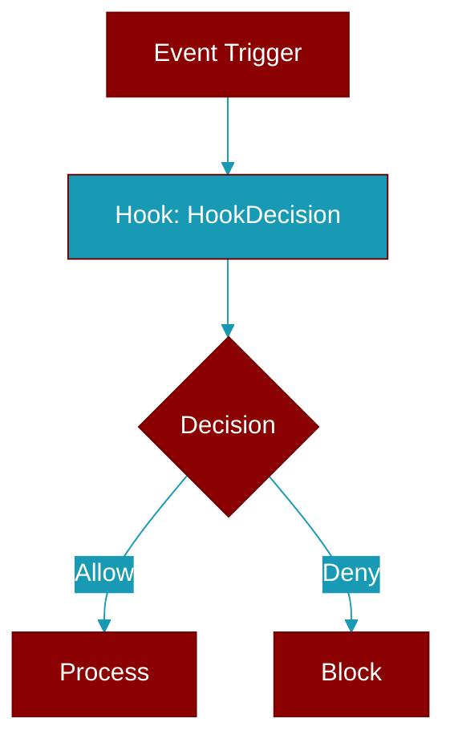

# HookDecision

> Defined in the [**hooks**](../modules/hooks) module.

<Badge color="orange">Rust AI Agent SDK</Badge>

Decision types for hook outputs

## Fields

| Name | Type | Description |
|------|------|-------------|
| `Allow` | `variant` | - |
| `the` | `variant` | - |
| `operation` | `variant` | - |
| `to` | `variant` | - |
| `proceed` | `variant` | - |
| `default` | `variant` | Allow the operation to proceed |
| `Allow` | `variant` | Allow the operation to proceed |
| `Deny` | `variant` | - |
| `the` | `variant` | - |
| `operation` | `variant` | - |
| `Deny` | `variant` | Deny the operation |
| `Block` | `variant` | - |
| `the` | `variant` | - |
| `operation` | `variant` | - |
| `Block` | `variant` | Block the operation (stronger than deny) |
| `Ask` | `variant` | - |
| `for` | `variant` | - |
| `user` | `variant` | - |
| `confirmation` | `variant` | - |
| `Ask` | `variant` | Ask for user confirmation |

## Source

<Card title="View on GitHub" icon="github" href="https://github.com/ARC-Solutions/praisonai-rust/blob/main/praisonai/src/hooks/mod.rs">
  `praisonai/src/hooks/mod.rs` at line 0
</Card>

---

## Related Documentation

<CardGroup cols={2}>
  <Card title="Hooks Concept" icon="anchor" href="/docs/concepts/hooks" />
  <Card title="Hook Events" icon="bolt" href="/docs/features/hook-events" />
  <Card title="Callbacks" icon="phone" href="/docs/features/callbacks" />
</CardGroup>
