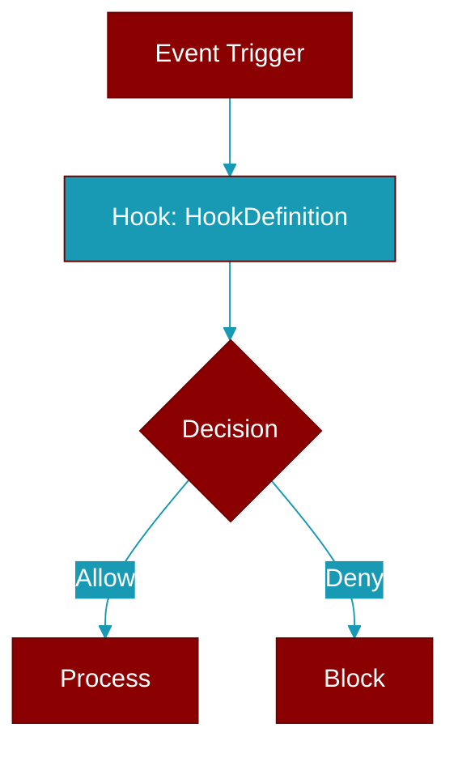

# HookDefinition

> Defined in the [**hooks**](../modules/hooks) module.

<Badge color="orange">Rust AI Agent SDK</Badge>

Hook definition



## Fields

| Name | Type | Description |
|------|------|-------------|
| `id` | `String` | Unique ID |
| `event` | `HookEvent` | Event to hook |
| `matcher` | `Option&lt;String&gt;` | Optional matcher pattern (regex for tool names, etc.) |
| `func` | `HookFn` | Hook function |
| `enabled` | `bool` | Whether hook is enabled |
| `name` | `Option&lt;String&gt;` | Hook name (for debugging) |

## Methods

### `new`

```rust
fn new(
        event: HookEvent,
        func: impl Fn(&HookInput) -> HookResult + Send + Sync + 'static,
    ) -> Self
```

Create a new hook definition

**Parameters:**

| Name | Type |
|------|------|
| `event` | `HookEvent` |
| `func` | `impl Fn(&HookInput` |

### `with_matcher`

```rust
fn with_matcher(mut self, pattern: impl Into<String>) -> Self
```

Set matcher pattern

**Parameters:**

| Name | Type |
|------|------|
| `pattern` | `impl Into&lt;String&gt;` |

### `with_name`

```rust
fn with_name(mut self, name: impl Into<String>) -> Self
```

Set name

**Parameters:**

| Name | Type |
|------|------|
| `name` | `impl Into&lt;String&gt;` |

### `matches`

```rust
fn matches(&self, target: &str) -> bool
```

Check if this hook matches the target

**Parameters:**

| Name | Type |
|------|------|
| `target` | `&str` |

### `execute`

```rust
fn execute(&self, input: &HookInput) -> HookResult
```

Execute the hook

**Parameters:**

| Name | Type |
|------|------|
| `input` | `&HookInput` |


## Source

<Card title="View on GitHub" icon="github" href="https://github.com/MervinPraison/PraisonAI/blob/main/src/praisonai-rust/praisonai/src/hooks/mod.rs#L285">
  `praisonai/src/hooks/mod.rs` at line 285
</Card>


---

## Related Documentation

<CardGroup cols={2}>
  <Card title="Rust Hooks" icon="anchor" href="/docs/rust/hooks" />
</CardGroup>
