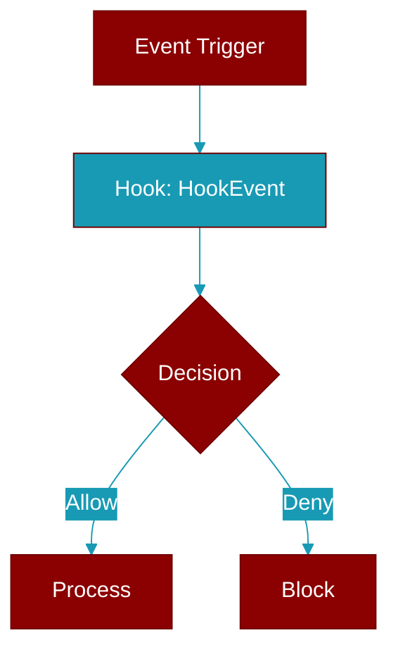

# HookEvent

> Defined in the [**hooks**](../modules/hooks) module.

<Badge color="orange">Rust AI Agent SDK</Badge>

Event names for the hook system

## Fields

| Name | Type | Description |
|------|------|-------------|
| `Before` | `variant` | - |
| `tool` | `variant` | - |
| `execution` | `variant` | - |
| `BeforeTool` | `variant` | Before tool execution |
| `After` | `variant` | - |
| `tool` | `variant` | - |
| `execution` | `variant` | - |
| `AfterTool` | `variant` | After tool execution |
| `Before` | `variant` | - |
| `agent` | `variant` | - |
| `processes` | `variant` | - |
| `a` | `variant` | - |
| `message` | `variant` | - |
| `BeforeAgent` | `variant` | Before agent processes a message |
| `After` | `variant` | - |
| `agent` | `variant` | - |
| `processes` | `variant` | - |
| `a` | `variant` | - |
| `message` | `variant` | - |
| `AfterAgent` | `variant` | After agent processes a message |
| `Before` | `variant` | - |
| `LLM` | `variant` | - |
| `call` | `variant` | - |
| `BeforeLlm` | `variant` | Before LLM call |
| `After` | `variant` | - |
| `LLM` | `variant` | - |
| `call` | `variant` | - |
| `AfterLlm` | `variant` | After LLM call |
| `Session` | `variant` | - |
| `start` | `variant` | - |
| `SessionStart` | `variant` | Session start |
| `Session` | `variant` | - |
| `end` | `variant` | - |
| `SessionEnd` | `variant` | Session end |
| `On` | `variant` | - |
| `error` | `variant` | - |
| `OnError` | `variant` | On error |
| `On` | `variant` | - |
| `retry` | `variant` | - |
| `OnRetry` | `variant` | On retry |
| `On` | `variant` | - |
| `initialization` | `variant` | - |
| `OnInit` | `variant` | On initialization |
| `On` | `variant` | - |
| `shutdown` | `variant` | - |
| `OnShutdown` | `variant` | On shutdown |

## Source

<Card title="View on GitHub" icon="github" href="https://github.com/MervinPraison/PraisonAI/blob/main/src/praisonai-rust/praisonai/src/hooks/mod.rs">
  `praisonai/src/hooks/mod.rs` at line 0
</Card>

---

## Related Documentation

<CardGroup cols={2}>
  <Card title="Rust Hooks" icon="anchor" href="/docs/rust/hooks" />
  <Card title="Rust Events" icon="bolt" href="/docs/rust/events" />
  <Card title="Rust Callbacks" icon="phone" href="/docs/rust/callbacks" />
</CardGroup>
