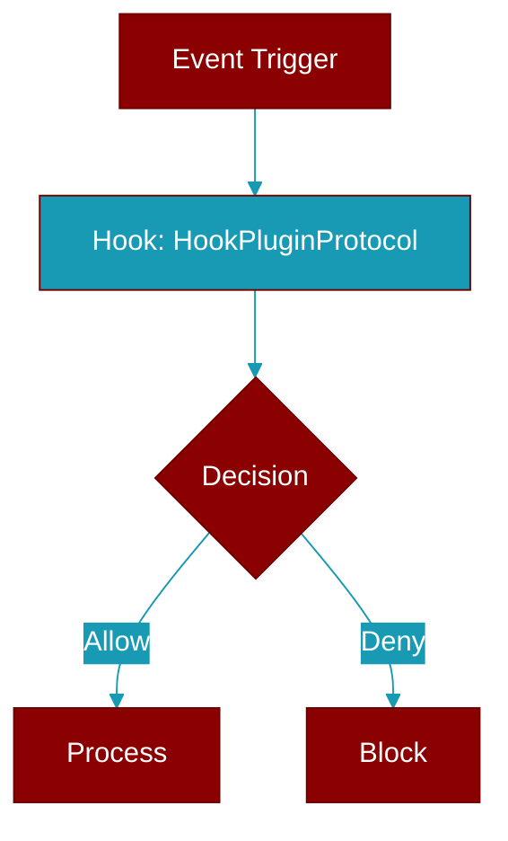

# HookPluginProtocol

> Defined in the [**plugins**](../modules/plugins) module.

<Badge color="orange">Rust AI Agent SDK</Badge>

Lifecycle hook plugin protocol



## Methods

### `before_agent`

```rust
fn before_agent(&self, _agent_name: &str, _input: &str) -> Result<Option<String>, String>
```

Called before agent execution

**Parameters:**

| Name | Type |
|------|------|
| `_agent_name` | `&str` |
| `_input` | `&str` |


## Source

<Card title="View on GitHub" icon="github" href="https://github.com/MervinPraison/PraisonAI/blob/main/src/praisonai-rust/praisonai/src/parity/plugins.rs">
  `praisonai/src/parity/plugins.rs` at line 0
</Card>


---

## Related Documentation

<CardGroup cols={2}>
  <Card title="Hooks Concept" icon="anchor" href="/docs/concepts/hooks" />
  <Card title="Hook Events" icon="bolt" href="/docs/features/hook-events" />
  <Card title="Callbacks" icon="phone" href="/docs/features/callbacks" />
  <Card title="Plugins Feature" icon="plug" href="/docs/features/plugins" />
</CardGroup>
