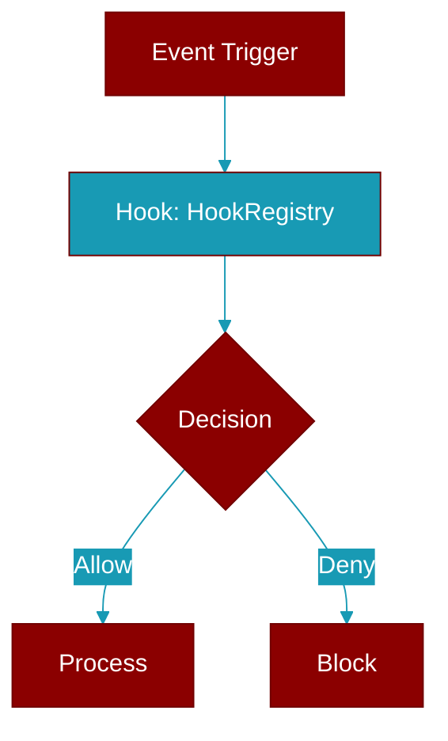

# HookRegistry

> Defined in the [**hooks**](../modules/hooks) module.

<Badge color="orange">Rust AI Agent SDK</Badge>

Hook registry for managing hooks



## Fields

| Name | Type | Description |
|------|------|-------------|
| `hooks` | `HashMap&lt;HookEvent` | - |

## Methods

### `new`

```rust
fn new() -> Self
```

Create a new hook registry

### `add_hook`

```rust
fn add_hook(
        &mut self,
        event: HookEvent,
        func: impl Fn(&HookInput) -> HookResult + Send + Sync + 'static,
    ) -> &mut Self
```

Add a hook

**Parameters:**

| Name | Type |
|------|------|
| `event` | `HookEvent` |
| `func` | `impl Fn(&HookInput` |

### `add_hook_with_matcher`

```rust
fn add_hook_with_matcher(
        &mut self,
        event: HookEvent,
        matcher: impl Into<String>,
        func: impl Fn(&HookInput) -> HookResult + Send + Sync + 'static,
    ) -> &mut Self
```

Add a hook with matcher

**Parameters:**

| Name | Type |
|------|------|
| `event` | `HookEvent` |
| `matcher` | `impl Into&lt;String&gt;` |
| `func` | `impl Fn(&HookInput` |

### `add_definition`

```rust
fn add_definition(&mut self, hook: HookDefinition) -> &mut Self
```

Add a hook definition

**Parameters:**

| Name | Type |
|------|------|
| `hook` | `HookDefinition` |

### `remove_hook`

```rust
fn remove_hook(&mut self, id: &str) -> bool
```

Remove a hook by ID

**Parameters:**

| Name | Type |
|------|------|
| `id` | `&str` |

### `has_hooks`

```rust
fn has_hooks(&self, event: HookEvent) -> bool
```

Check if any hooks exist for an event

**Parameters:**

| Name | Type |
|------|------|
| `event` | `HookEvent` |

### `hook_count`

```rust
fn hook_count(&self, event: HookEvent) -> usize
```

Get hook count for an event

**Parameters:**

| Name | Type |
|------|------|
| `event` | `HookEvent` |

### `execute`

```rust
fn execute(&self, event: HookEvent, input: &HookInput) -> HookResult
```

Execute all hooks for an event

**Parameters:**

| Name | Type |
|------|------|
| `event` | `HookEvent` |
| `input` | `&HookInput` |

### `execute_async`

```rust
async fn execute_async(&self, event: HookEvent, input: &HookInput) -> HookResult
```

Execute hooks asynchronously (for future async hooks)

**Parameters:**

| Name | Type |
|------|------|
| `event` | `HookEvent` |
| `input` | `&HookInput` |


## Source

<Card title="View on GitHub" icon="github" href="https://github.com/MervinPraison/PraisonAI/blob/main/src/praisonai-rust/praisonai/src/hooks/mod.rs#L359">
  `praisonai/src/hooks/mod.rs` at line 359
</Card>


---

## Related Documentation

<CardGroup cols={2}>
  <Card title="Rust Hooks" icon="anchor" href="/docs/rust/hooks" />
</CardGroup>
