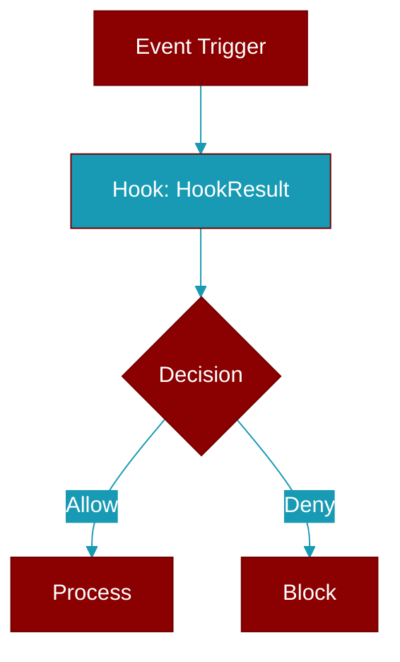

# HookResult

> Defined in the [**hooks**](../modules/hooks) module.

<Badge color="orange">Rust AI Agent SDK</Badge>

Result from a hook execution



## Fields

| Name | Type | Description |
|------|------|-------------|
| `decision` | `HookDecision` | Decision (allow, deny, block, ask) |
| `reason` | `Option&lt;String&gt;` | Reason for the decision |
| `modified_input` | `Option&lt;HashMap&lt;String` | Modified input data (optional) |
| `serde_json` | `:Value&gt;&gt;` | Modified input data (optional) |
| `additional_context` | `Option&lt;String&gt;` | Additional context |
| `suppress_output` | `bool` | Whether to suppress output |

## Methods

### `allow`

```rust
fn allow() -> Self
```

Create an allow result

### `allow_with_reason`

```rust
fn allow_with_reason(reason: impl Into<String>) -> Self
```

Create an allow result with reason

**Parameters:**

| Name | Type |
|------|------|
| `reason` | `impl Into&lt;String&gt;` |

### `deny`

```rust
fn deny(reason: impl Into<String>) -> Self
```

Create a deny result

**Parameters:**

| Name | Type |
|------|------|
| `reason` | `impl Into&lt;String&gt;` |

### `block`

```rust
fn block(reason: impl Into<String>) -> Self
```

Create a block result

**Parameters:**

| Name | Type |
|------|------|
| `reason` | `impl Into&lt;String&gt;` |

### `ask`

```rust
fn ask(reason: impl Into<String>) -> Self
```

Create an ask result

**Parameters:**

| Name | Type |
|------|------|
| `reason` | `impl Into&lt;String&gt;` |

### `is_allowed`

```rust
fn is_allowed(&self) -> bool
```

Check if the result allows execution

### `is_denied`

```rust
fn is_denied(&self) -> bool
```

Check if the result denies execution

### `with_modified_input`

```rust
fn with_modified_input(mut self, input: HashMap<String, serde_json::Value>) -> Self
```

Add modified input

**Parameters:**

| Name | Type |
|------|------|
| `input` | `HashMap&lt;String` |
| `serde_json` | `:Value&gt;` |

### `with_context`

```rust
fn with_context(mut self, context: impl Into<String>) -> Self
```

Add additional context

**Parameters:**

| Name | Type |
|------|------|
| `context` | `impl Into&lt;String&gt;` |

### `suppress`

```rust
fn suppress(mut self) -> Self
```

Suppress output


## Source

<Card title="View on GitHub" icon="github" href="https://github.com/ARC-Solutions/praisonai-rust/blob/main/praisonai/src/hooks/mod.rs#L177">
  `praisonai/src/hooks/mod.rs` at line 177
</Card>


---

## Related Documentation

<CardGroup cols={2}>
  <Card title="Hooks Concept" icon="anchor" href="/docs/concepts/hooks" />
  <Card title="Hook Events" icon="bolt" href="/docs/features/hook-events" />
  <Card title="Callbacks" icon="phone" href="/docs/features/callbacks" />
</CardGroup>
