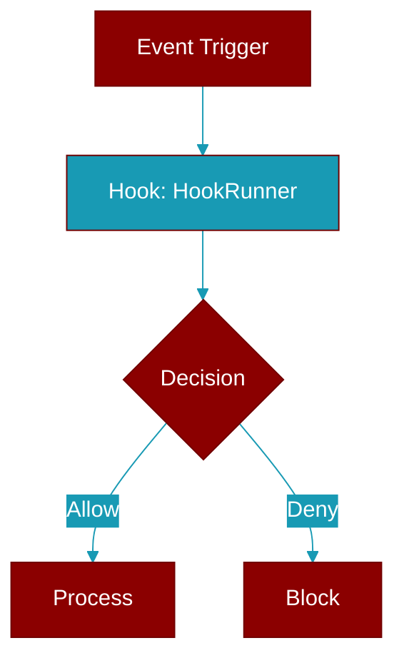

# HookRunner

> Defined in the [**hooks**](../modules/hooks) module.

<Badge color="orange">Rust AI Agent SDK</Badge>

Hook runner for executing hooks in a workflow



## Fields

| Name | Type | Description |
|------|------|-------------|
| `registry` | `Arc&lt;HookRegistry&gt;` | - |

## Methods

### `new`

```rust
fn new(registry: HookRegistry) -> Self
```

Create a new hook runner

**Parameters:**

| Name | Type |
|------|------|
| `registry` | `HookRegistry` |

### `before_tool`

```rust
fn before_tool(
        &self,
        session_id: &str,
        tool_name: &str,
        args: serde_json::Value,
    ) -> Result<HookResult>
```

Run before-tool hooks

**Parameters:**

| Name | Type |
|------|------|
| `session_id` | `&str` |
| `tool_name` | `&str` |
| `args` | `serde_json::Value` |

### `after_tool`

```rust
fn after_tool(
        &self,
        session_id: &str,
        tool_name: &str,
        result: serde_json::Value,
    ) -> Result<HookResult>
```

Run after-tool hooks

**Parameters:**

| Name | Type |
|------|------|
| `session_id` | `&str` |
| `tool_name` | `&str` |
| `result` | `serde_json::Value` |

### `before_agent`

```rust
fn before_agent(
        &self,
        session_id: &str,
        agent_name: &str,
        message: &str,
    ) -> Result<HookResult>
```

Run before-agent hooks

**Parameters:**

| Name | Type |
|------|------|
| `session_id` | `&str` |
| `agent_name` | `&str` |
| `message` | `&str` |

### `after_agent`

```rust
fn after_agent(
        &self,
        session_id: &str,
        agent_name: &str,
        response: &str,
    ) -> Result<HookResult>
```

Run after-agent hooks

**Parameters:**

| Name | Type |
|------|------|
| `session_id` | `&str` |
| `agent_name` | `&str` |
| `response` | `&str` |

### `on_error`

```rust
fn on_error(&self, session_id: &str, error: &str) -> Result<HookResult>
```

Run on-error hooks

**Parameters:**

| Name | Type |
|------|------|
| `session_id` | `&str` |
| `error` | `&str` |


## Source

<Card title="View on GitHub" icon="github" href="https://github.com/ARC-Solutions/praisonai-rust/blob/main/praisonai/src/hooks/mod.rs#L461">
  `praisonai/src/hooks/mod.rs` at line 461
</Card>


---

## Related Documentation

<CardGroup cols={2}>
  <Card title="Hooks Concept" icon="anchor" href="/docs/concepts/hooks" />
  <Card title="Hook Events" icon="bolt" href="/docs/features/hook-events" />
  <Card title="Callbacks" icon="phone" href="/docs/features/callbacks" />
</CardGroup>
