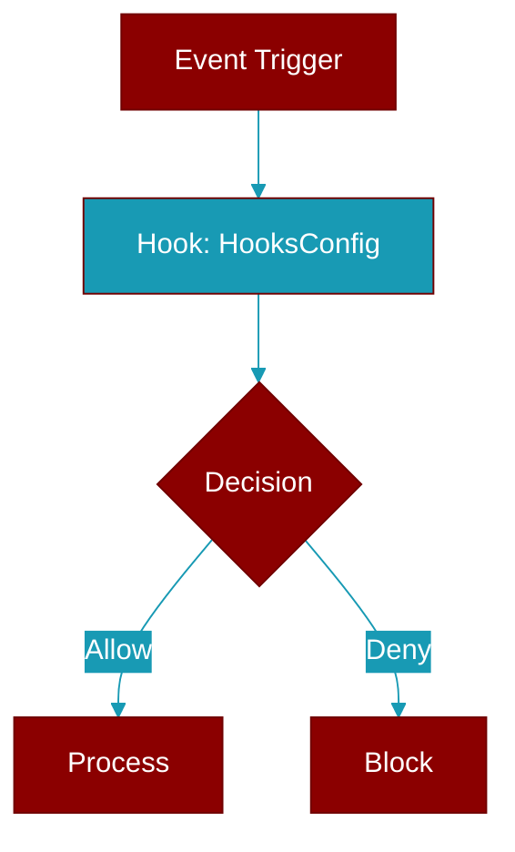

# HooksConfig

> Defined in the [**config**](../modules/config) module.

<Badge color="orange">Rust AI Agent SDK</Badge>

Hooks configuration for before/after tool execution



## Fields

| Name | Type | Description |
|------|------|-------------|
| `enabled` | `bool` | Enable hooks |

## Methods

### `new`

```rust
fn new() -> Self
```

Create a new hooks config

### `enabled`

```rust
fn enabled(mut self) -> Self
```

Enable hooks


## Source

<Card title="View on GitHub" icon="github" href="https://github.com/MervinPraison/PraisonAI/blob/main/src/praisonai-rust/praisonai/src/config.rs#L93">
  `praisonai/src/config.rs` at line 93
</Card>


---

## Related Documentation

<CardGroup cols={2}>
  <Card title="Rust Hooks" icon="anchor" href="/docs/rust/hooks" />
  <Card title="Rust Events" icon="bolt" href="/docs/rust/events" />
  <Card title="Rust Callbacks" icon="phone" href="/docs/rust/callbacks" />
  <Card title="Rust Configuration" icon="gear" href="/docs/rust/configuration" />
  <Card title="Rust Installation" icon="download" href="/docs/rust/installation" />
</CardGroup>
