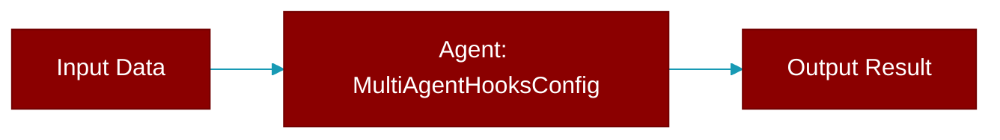

# MultiAgentHooksConfig

> Defined in the [**config**](../modules/config) module.

<Badge color="orange">Rust AI Agent SDK</Badge>

Configuration for multi-agent hooks

## Fields

| Name | Type | Description |
|------|------|-------------|
| `on_task_start` | `bool` | Enable task start callback |
| `on_task_complete` | `bool` | Enable task complete callback |
| `completion_checker` | `bool` | Enable completion checker |

## Source

<Card title="View on GitHub" icon="github" href="https://github.com/MervinPraison/PraisonAI/blob/main/src/praisonai-rust/praisonai/src/config.rs#L981">
  `praisonai/src/config.rs` at line 981
</Card>

---

## Related Documentation

<CardGroup cols={2}>
  <Card title="Rust Overview" icon="book-open" href="/docs/rust/overview" />
  <Card title="Rust Quickstart" icon="rocket" href="/docs/rust/quickstart" />
  <Card title="Rust Agent Guide" icon="robot" href="/docs/rust/agent" />
  <Card title="Rust Installation" icon="download" href="/docs/rust/installation" />
  <Card title="Rust Hooks" icon="anchor" href="/docs/rust/hooks" />
</CardGroup>
