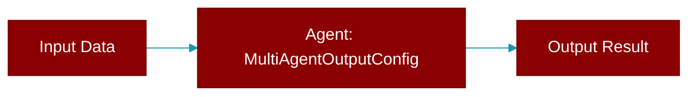

# MultiAgentOutputConfig

> Defined in the [**config**](../modules/config) module.

<Badge color="orange">Rust AI Agent SDK</Badge>

Configuration for multi-agent output

## Fields

| Name | Type | Description |
|------|------|-------------|
| `verbose` | `u8` | Verbosity level (0=silent, 1=minimal, 2+=verbose) |
| `stream` | `bool` | Enable streaming output |

## Source

<Card title="View on GitHub" icon="github" href="https://github.com/MervinPraison/PraisonAI/blob/main/src/praisonai-rust/praisonai/src/config.rs#L997">
  `praisonai/src/config.rs` at line 997
</Card>

---

## Related Documentation

<CardGroup cols={2}>
  <Card title="Rust Agent" icon="robot" href="/docs/rust/agent" />
  <Card title="Rust Overview" icon="book-open" href="/docs/rust/overview" />
  <Card title="Rust Quickstart" icon="rocket" href="/docs/rust/quickstart" />
  <Card title="Rust Installation" icon="download" href="/docs/rust/installation" />
  <Card title="Rust Autonomy" icon="wand-magic-sparkles" href="/docs/rust/autonomy" />
</CardGroup>
