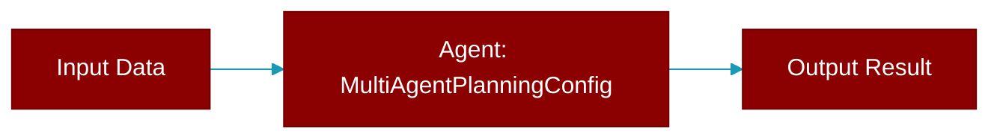

# MultiAgentPlanningConfig

> Defined in the [**config**](../modules/config) module.

<Badge color="orange">Rust AI Agent SDK</Badge>

Configuration for multi-agent planning

## Fields

| Name | Type | Description |
|------|------|-------------|
| `llm` | `Option&lt;String&gt;` | Planning LLM model |
| `auto_approve` | `bool` | Auto-approve generated plans |
| `reasoning` | `bool` | Enable reasoning in planning |

## Source

<Card title="View on GitHub" icon="github" href="https://github.com/MervinPraison/PraisonAI/blob/main/src/praisonai-rust/praisonai/src/config.rs#L1038">
  `praisonai/src/config.rs` at line 1038
</Card>

---

## Related Documentation

<CardGroup cols={2}>
  <Card title="Rust Overview" icon="book-open" href="/docs/rust/overview" />
  <Card title="Rust Quickstart" icon="rocket" href="/docs/rust/quickstart" />
  <Card title="Rust Agent Guide" icon="robot" href="/docs/rust/agent" />
  <Card title="Rust Installation" icon="download" href="/docs/rust/installation" />
  <Card title="Rust Configuration" icon="gear" href="/docs/rust/configuration" />
</CardGroup>
