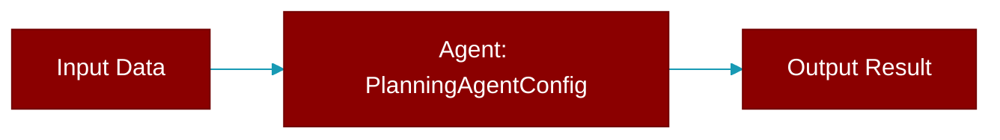

# PlanningAgentConfig

> Defined in the [**specialized**](../modules/specialized) module.

<Badge color="orange">Rust AI Agent SDK</Badge>

Planning agent configuration

## Fields

| Name | Type | Description |
|------|------|-------------|
| `max_steps` | `usize` | Maximum planning steps |
| `reasoning` | `bool` | Enable reasoning |
| `llm` | `Option&lt;String&gt;` | Planning LLM model |

## Source

<Card title="View on GitHub" icon="github" href="https://github.com/MervinPraison/PraisonAI/blob/main/src/praisonai-rust/praisonai/src/parity/specialized.rs#L143">
  `praisonai/src/parity/specialized.rs` at line 143
</Card>

---

## Related Documentation

<CardGroup cols={2}>
  <Card title="Rust Overview" icon="book-open" href="/docs/rust/overview" />
  <Card title="Rust Quickstart" icon="rocket" href="/docs/rust/quickstart" />
  <Card title="Rust Agent Guide" icon="robot" href="/docs/rust/agent" />
  <Card title="Rust Installation" icon="download" href="/docs/rust/installation" />
  <Card title="Rust Configuration" icon="gear" href="/docs/rust/configuration" />
</CardGroup>
