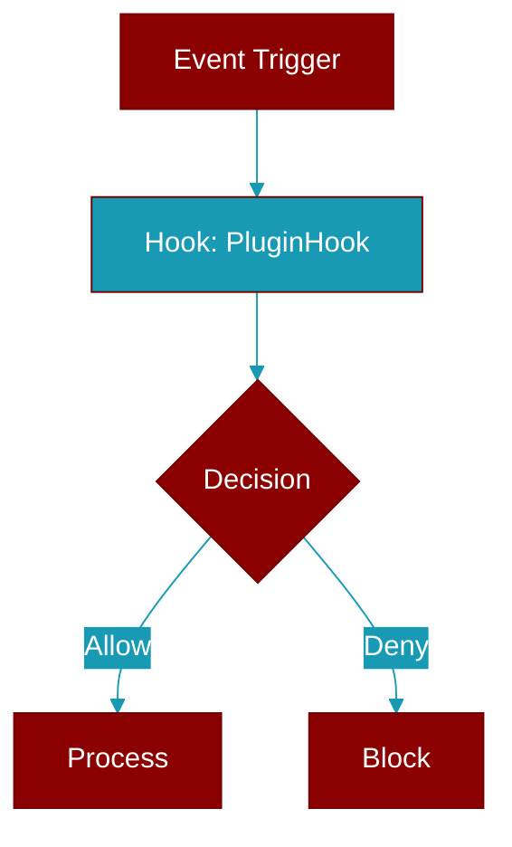

# PluginHook

> Defined in the [**plugins**](../modules/plugins) module.

<Badge color="orange">Rust AI Agent SDK</Badge>

Hook points for plugin execution.



## Fields

| Name | Type | Description |
|------|------|-------------|
| `Before` | `variant` | - |
| `agent` | `variant` | - |
| `starts` | `variant` | - |
| `processing` | `variant` | - |
| `BeforeAgent` | `variant` | Before agent starts processing |
| `After` | `variant` | - |
| `agent` | `variant` | - |
| `completes` | `variant` | - |
| `processing` | `variant` | - |
| `AfterAgent` | `variant` | After agent completes processing |
| `Before` | `variant` | - |
| `tool` | `variant` | - |
| `execution` | `variant` | - |
| `BeforeTool` | `variant` | Before tool execution |
| `After` | `variant` | - |
| `tool` | `variant` | - |
| `execution` | `variant` | - |
| `AfterTool` | `variant` | After tool execution |
| `Before` | `variant` | - |
| `LLM` | `variant` | - |
| `call` | `variant` | - |
| `BeforeLlm` | `variant` | Before LLM call |
| `After` | `variant` | - |
| `LLM` | `variant` | - |
| `call` | `variant` | - |
| `AfterLlm` | `variant` | After LLM call |
| `Before` | `variant` | - |
| `memory` | `variant` | - |
| `operation` | `variant` | - |
| `BeforeMemory` | `variant` | Before memory operation |
| `After` | `variant` | - |
| `memory` | `variant` | - |
| `operation` | `variant` | - |
| `AfterMemory` | `variant` | After memory operation |
| `On` | `variant` | - |
| `error` | `variant` | - |
| `OnError` | `variant` | On error |
| `On` | `variant` | - |
| `workflow` | `variant` | - |
| `start` | `variant` | - |
| `OnWorkflowStart` | `variant` | On workflow start |
| `On` | `variant` | - |
| `workflow` | `variant` | - |
| `end` | `variant` | - |
| `OnWorkflowEnd` | `variant` | On workflow end |
| `On` | `variant` | - |
| `handoff` | `variant` | - |
| `OnHandoff` | `variant` | On handoff |

## Methods

### `all`

```rust
fn all() -> Vec<PluginHook>
```

Get all hook types


## Source

<Card title="View on GitHub" icon="github" href="https://github.com/MervinPraison/PraisonAI/blob/main/src/praisonai-rust/praisonai/src/plugins/mod.rs">
  `praisonai/src/plugins/mod.rs` at line 0
</Card>


---

## Related Documentation

<CardGroup cols={2}>
  <Card title="Rust Hooks" icon="anchor" href="/docs/rust/hooks" />
  <Card title="Rust Events" icon="bolt" href="/docs/rust/events" />
  <Card title="Rust Callbacks" icon="phone" href="/docs/rust/callbacks" />
  <Card title="Rust Plugins" icon="plug" href="/docs/rust/plugins" />
</CardGroup>
