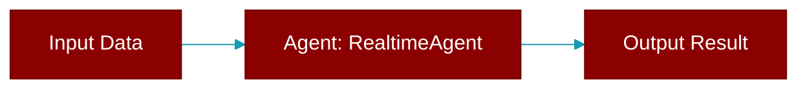

# RealtimeAgent

> Defined in the [**agents**](../modules/agents) module.

<Badge color="orange">Rust AI Agent SDK</Badge>

Agent for real-time voice conversations.



## Fields

| Name | Type | Description |
|------|------|-------------|
| `name` | `String` | - |
| `model` | `String` | Model to use |
| `config` | `RealtimeConfig` | Configuration |
| `verbose` | `bool` | - |

## Methods

### `new`

```rust
fn new() -> RealtimeAgentBuilder
```

Create a new builder

### `name`

```rust
fn name(&self) -> &str
```

Get agent name

### `send_text`

```rust
fn send_text(&self, text: &str) -> Result<String>
```

Send text message (placeholder)

**Parameters:**

| Name | Type |
|------|------|
| `text` | `&str` |


## Source

<Card title="View on GitHub" icon="github" href="https://github.com/MervinPraison/PraisonAI/blob/main/src/praisonai-rust/praisonai/src/agents/mod.rs#L1304">
  `praisonai/src/agents/mod.rs` at line 1304
</Card>


---

## Related Documentation

<CardGroup cols={2}>
  <Card title="Rust Overview" icon="book-open" href="/docs/rust/overview" />
  <Card title="Rust Quickstart" icon="rocket" href="/docs/rust/quickstart" />
  <Card title="Rust Agent Guide" icon="robot" href="/docs/rust/agent" />
  <Card title="Rust Installation" icon="download" href="/docs/rust/installation" />
</CardGroup>
