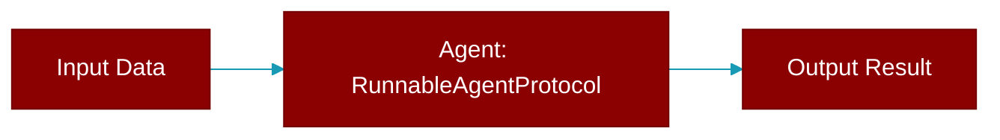

# RunnableAgentProtocol

> Defined in the [**protocols**](../modules/protocols) module.

<Badge color="orange">Rust AI Agent SDK</Badge>

Extended Protocol for agents that support run/start methods.



## Methods

### `run`

```rust
fn run(&self, prompt: &str) -> Result<String>
```

Run the agent with a prompt (alias for chat in most cases)

**Parameters:**

| Name | Type |
|------|------|
| `prompt` | `&str` |


## Source

<Card title="View on GitHub" icon="github" href="https://github.com/MervinPraison/PraisonAI/blob/main/src/praisonai-rust/praisonai/src/protocols/mod.rs">
  `praisonai/src/protocols/mod.rs` at line 0
</Card>


---

## Related Documentation

<CardGroup cols={2}>
  <Card title="Rust Overview" icon="book-open" href="/docs/rust/overview" />
  <Card title="Rust Quickstart" icon="rocket" href="/docs/rust/quickstart" />
  <Card title="Rust Agent Guide" icon="robot" href="/docs/rust/agent" />
  <Card title="Rust Installation" icon="download" href="/docs/rust/installation" />
</CardGroup>
