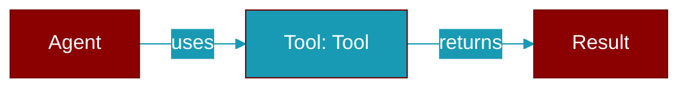

# Tool

> Defined in the [**tools**](../modules/tools) module.

<Badge color="orange">Rust AI Agent SDK</Badge>

Trait for tools that can be used by agents This trait defines the interface for tools. Tools can be created using the `#[tool]` macro or by implementing this trait directly.



## Methods

### `name`

```rust
fn name(&self) -> &str
```

Get the tool name

### `description`

```rust
fn description(&self) -> &str
```

Get the tool description

### `parameters_schema`

```rust
fn parameters_schema(&self) -> Value
```

Get the parameter schema as JSON Schema

### `execute`

```rust
async fn execute(&self, args: Value) -> Result<Value>
```

Execute the tool with the given arguments

**Parameters:**

| Name | Type |
|------|------|
| `args` | `Value` |

### `definition`

```rust
fn definition(&self) -> ToolDefinition
```

Get the tool definition for LLM function calling


## Source

<Card title="View on GitHub" icon="github" href="https://github.com/MervinPraison/PraisonAI/blob/main/src/praisonai-rust/praisonai/src/tools/mod.rs">
  `praisonai/src/tools/mod.rs` at line 0
</Card>


---

## Related Documentation

<CardGroup cols={2}>
  <Card title="Rust Tools" icon="wrench" href="/docs/rust/tools" />
  <Card title="Rust Overview" icon="book-open" href="/docs/rust/overview" />
</CardGroup>
