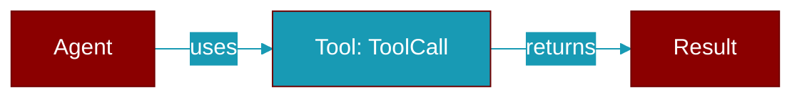

# ToolCall

> Defined in the [**protocols**](../modules/protocols) module.

<Badge color="orange">Rust AI Agent SDK</Badge>

A tool call from the LLM.

## Fields

| Name | Type | Description |
|------|------|-------------|
| `id` | `String` | Tool call ID |
| `name` | `String` | Tool name |
| `arguments` | `serde_json::Value` | Tool arguments |

## Source

<Card title="View on GitHub" icon="github" href="https://github.com/MervinPraison/PraisonAI/blob/main/src/praisonai-rust/praisonai/src/protocols/mod.rs#L210">
  `praisonai/src/protocols/mod.rs` at line 210
</Card>

---

## Related Documentation

<CardGroup cols={2}>
  <Card title="Rust Tools" icon="wrench" href="/docs/rust/tools" />
  <Card title="Rust Code Execution" icon="terminal" href="/docs/rust/code-execution" />
  <Card title="Rust Web Search" icon="search" href="/docs/rust/web-search" />
</CardGroup>
