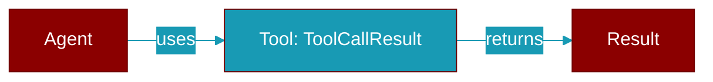

# ToolCallResult

> Defined in the [**eval**](../modules/eval) module.

<Badge color="orange">Rust AI Agent SDK</Badge>

Result of a tool call during evaluation.



## Fields

| Name | Type | Description |
|------|------|-------------|
| `name` | `String` | Tool name |
| `expected` | `bool` | Whether the call was expected |
| `called` | `bool` | Whether the call was made |
| `arguments` | `Option&lt;serde_json::Value&gt;` | Arguments used |
| `result` | `Option&lt;serde_json::Value&gt;` | Result returned |

## Methods

### `new`

```rust
fn new(name: impl Into<String>, expected: bool, called: bool) -> Self
```

Create a new tool call result.

**Parameters:**

| Name | Type |
|------|------|
| `name` | `impl Into&lt;String&gt;` |
| `expected` | `bool` |
| `called` | `bool` |

### `is_correct`

```rust
fn is_correct(&self) -> bool
```

Check if correct (expected == called).


## Source

<Card title="View on GitHub" icon="github" href="https://github.com/ARC-Solutions/praisonai-rust/blob/main/praisonai/src/eval/mod.rs#L146">
  `praisonai/src/eval/mod.rs` at line 146
</Card>


---

## Related Documentation

<CardGroup cols={2}>
  <Card title="Tools Concept" icon="wrench" href="/docs/concepts/tools" />
  <Card title="Create Custom Tools" icon="plus" href="/docs/guides/tools/create-custom-tools" />
  <Card title="Tool Development" icon="code" href="/docs/tutorials/advanced-tool-development" />
</CardGroup>
