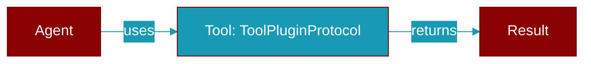

# ToolPluginProtocol

> Defined in the [**plugins**](../modules/plugins) module.

<Badge color="orange">Rust AI Agent SDK</Badge>

Tool-providing plugin protocol



## Methods

### `get_tools`

```rust
fn get_tools(&self) -> Vec<ToolDefinition>
```

Get tool definitions provided by this plugin

### `execute_tool`

```rust
fn execute_tool(&self, name: &str, args: serde_json::Value) -> Result<serde_json::Value, String>
```

Execute a tool by name

**Parameters:**

| Name | Type |
|------|------|
| `name` | `&str` |
| `args` | `serde_json::Value` |


## Source

<Card title="View on GitHub" icon="github" href="https://github.com/ARC-Solutions/praisonai-rust/blob/main/praisonai/src/parity/plugins.rs">
  `praisonai/src/parity/plugins.rs` at line 0
</Card>


---

## Related Documentation

<CardGroup cols={2}>
  <Card title="Tools Concept" icon="wrench" href="/docs/concepts/tools" />
  <Card title="Create Custom Tools" icon="plus" href="/docs/guides/tools/create-custom-tools" />
  <Card title="Tool Development" icon="code" href="/docs/tutorials/advanced-tool-development" />
  <Card title="Plugins Feature" icon="plug" href="/docs/features/plugins" />
</CardGroup>
