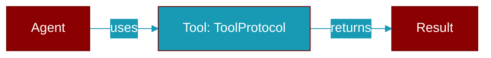

# ToolProtocol

> Defined in the [**protocols**](../modules/protocols) module.

<Badge color="orange">Rust AI Agent SDK</Badge>

Protocol for tool implementations.



## Methods

### `name`

```rust
fn name(&self) -> &str
```

Get the tool's name

### `description`

```rust
fn description(&self) -> &str
```

Get the tool's description

### `parameters_schema`

```rust
fn parameters_schema(&self) -> serde_json::Value
```

Get the tool's parameter schema

### `execute`

```rust
async fn execute(&self, args: serde_json::Value) -> Result<serde_json::Value>
```

Execute the tool with arguments

**Parameters:**

| Name | Type |
|------|------|
| `args` | `serde_json::Value` |


## Source

<Card title="View on GitHub" icon="github" href="https://github.com/MervinPraison/PraisonAI/blob/main/src/praisonai-rust/praisonai/src/protocols/mod.rs">
  `praisonai/src/protocols/mod.rs` at line 0
</Card>


---

## Related Documentation

<CardGroup cols={2}>
  <Card title="Tools Concept" icon="wrench" href="/docs/concepts/tools" />
  <Card title="Create Custom Tools" icon="plus" href="/docs/guides/tools/create-custom-tools" />
  <Card title="Tool Development" icon="code" href="/docs/tutorials/advanced-tool-development" />
</CardGroup>
