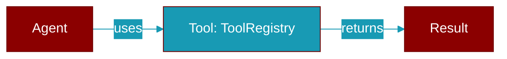

# ToolRegistry

> Defined in the [**tools**](../modules/tools) module.

<Badge color="orange">Rust AI Agent SDK</Badge>

Registry for managing tools



## Fields

| Name | Type | Description |
|------|------|-------------|
| `tools` | `HashMap&lt;String` | - |

## Methods

### `new`

```rust
fn new() -> Self
```

Create a new empty registry

### `register`

```rust
fn register(&mut self, tool: impl Tool + 'static) -> ()
```

Register a tool

**Parameters:**

| Name | Type |
|------|------|
| `tool` | `impl Tool + 'static` |

### `get`

```rust
fn get(&self, name: &str) -> Option<Arc<dyn Tool>>
```

Get a tool by name

**Parameters:**

| Name | Type |
|------|------|
| `name` | `&str` |

### `has`

```rust
fn has(&self, name: &str) -> bool
```

Check if a tool exists

**Parameters:**

| Name | Type |
|------|------|
| `name` | `&str` |

### `list`

```rust
fn list(&self) -> Vec<&str>
```

List all tool names

### `definitions`

```rust
fn definitions(&self) -> Vec<ToolDefinition>
```

Get all tool definitions

### `execute`

```rust
async fn execute(&self, name: &str, args: Value) -> Result<ToolResult>
```

Execute a tool by name

**Parameters:**

| Name | Type |
|------|------|
| `name` | `&str` |
| `args` | `Value` |

### `len`

```rust
fn len(&self) -> usize
```

Get the number of registered tools

### `is_empty`

```rust
fn is_empty(&self) -> bool
```

Check if the registry is empty


## Source

<Card title="View on GitHub" icon="github" href="https://github.com/MervinPraison/PraisonAI/blob/main/src/praisonai-rust/praisonai/src/tools/mod.rs#L101">
  `praisonai/src/tools/mod.rs` at line 101
</Card>


---

## Related Documentation

<CardGroup cols={2}>
  <Card title="Tools Concept" icon="wrench" href="/docs/concepts/tools" />
  <Card title="Create Custom Tools" icon="plus" href="/docs/guides/tools/create-custom-tools" />
  <Card title="Tool Development" icon="code" href="/docs/tutorials/advanced-tool-development" />
</CardGroup>
