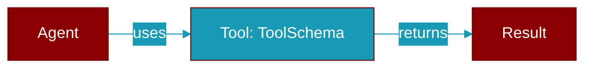

# ToolSchema

> Defined in the [**protocols**](../modules/protocols) module.

<Badge color="orange">Rust AI Agent SDK</Badge>

Tool schema for LLM.

## Fields

| Name | Type | Description |
|------|------|-------------|
| `name` | `String` | Tool name |
| `description` | `String` | Tool description |
| `parameters` | `serde_json::Value` | Parameter schema |

## Source

<Card title="View on GitHub" icon="github" href="https://github.com/MervinPraison/PraisonAI/blob/main/src/praisonai-rust/praisonai/src/protocols/mod.rs#L232">
  `praisonai/src/protocols/mod.rs` at line 232
</Card>

---

## Related Documentation

<CardGroup cols={2}>
  <Card title="Tools Concept" icon="wrench" href="/docs/concepts/tools" />
  <Card title="Create Custom Tools" icon="plus" href="/docs/guides/tools/create-custom-tools" />
  <Card title="Tool Development" icon="code" href="/docs/tutorials/advanced-tool-development" />
</CardGroup>
