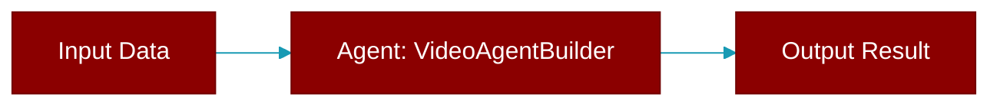

# VideoAgentBuilder

> Defined in the [**agents**](../modules/agents) module.

<Badge color="orange">Rust AI Agent SDK</Badge>

Builder for VideoAgent



## Fields

| Name | Type | Description |
|------|------|-------------|
| `name` | `Option&lt;String&gt;` | - |
| `model` | `Option&lt;String&gt;` | - |
| `config` | `VideoConfig` | - |
| `verbose` | `bool` | - |

## Methods

### `name`

```rust
fn name(mut self, name: impl Into<String>) -> Self
```

Set the agent name

**Parameters:**

| Name | Type |
|------|------|
| `name` | `impl Into&lt;String&gt;` |

### `model`

```rust
fn model(mut self, model: impl Into<String>) -> Self
```

Set the model

**Parameters:**

| Name | Type |
|------|------|
| `model` | `impl Into&lt;String&gt;` |

### `config`

```rust
fn config(mut self, config: VideoConfig) -> Self
```

Set the config

**Parameters:**

| Name | Type |
|------|------|
| `config` | `VideoConfig` |

### `build`

```rust
fn build(self) -> Result<VideoAgent>
```

Build the VideoAgent


## Source

<Card title="View on GitHub" icon="github" href="https://github.com/MervinPraison/PraisonAI/blob/main/src/praisonai-rust/praisonai/src/agents/mod.rs#L518">
  `praisonai/src/agents/mod.rs` at line 518
</Card>


---

## Related Documentation

<CardGroup cols={2}>
  <Card title="Rust Agent" icon="robot" href="/docs/rust/agent" />
  <Card title="Rust Overview" icon="book-open" href="/docs/rust/overview" />
  <Card title="Rust Quickstart" icon="rocket" href="/docs/rust/quickstart" />
  <Card title="Rust Installation" icon="download" href="/docs/rust/installation" />
  <Card title="Rust Autonomy" icon="wand-magic-sparkles" href="/docs/rust/autonomy" />
</CardGroup>
