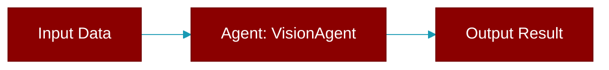

# VisionAgent

> Defined in the [**agents**](../modules/agents) module.

<Badge color="orange">Rust AI Agent SDK</Badge>

A specialized agent for image analysis and understanding.



## Fields

| Name | Type | Description |
|------|------|-------------|
| `name` | `String` | Agent name |
| `model` | `String` | LLM model (e.g., "gpt-4o", "claude-3-5-sonnet") |
| `config` | `VisionConfig` | Vision configuration |
| `verbose` | `bool` | Verbose output |

## Methods

### `new`

```rust
fn new() -> VisionAgentBuilder
```

Create a new VisionAgent builder

### `name`

```rust
fn name(&self) -> &str
```

Get agent name

### `describe`

```rust
fn describe(&self, image_source: &str) -> Result<String>
```

Describe an image (placeholder)

**Parameters:**

| Name | Type |
|------|------|
| `image_source` | `&str` |

### `analyze`

```rust
fn analyze(&self, image_source: &str, prompt: &str) -> Result<String>
```

Analyze an image with a custom prompt (placeholder)

**Parameters:**

| Name | Type |
|------|------|
| `image_source` | `&str` |
| `prompt` | `&str` |

### `compare`

```rust
fn compare(&self, images: &[&str]) -> Result<String>
```

Compare multiple images (placeholder)

**Parameters:**

| Name | Type |
|------|------|
| `images` | `&[&str]` |


## Source

<Card title="View on GitHub" icon="github" href="https://github.com/MervinPraison/PraisonAI/blob/main/src/praisonai-rust/praisonai/src/agents/mod.rs#L945">
  `praisonai/src/agents/mod.rs` at line 945
</Card>


---

## Related Documentation

<CardGroup cols={2}>
  <Card title="Rust Agent" icon="robot" href="/docs/rust/agent" />
  <Card title="Rust Overview" icon="book-open" href="/docs/rust/overview" />
  <Card title="Rust Quickstart" icon="rocket" href="/docs/rust/quickstart" />
  <Card title="Rust Installation" icon="download" href="/docs/rust/installation" />
  <Card title="Rust Autonomy" icon="wand-magic-sparkles" href="/docs/rust/autonomy" />
</CardGroup>
