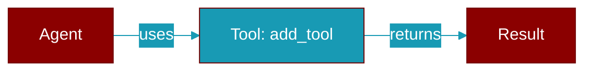

# add_tool

<div className="flex items-center gap-2">
  <Badge color="blue">Async</Badge>
  <Badge color="purple">Method</Badge>
</div>

> This is a method of the [**Agent**](../classes/Agent) class in the [**agent**](../modules/agent) module.

Add a tool to the agent



## Signature

```python
async def add_tool(&self, tool: impl Tool + 'static) -> ()
```

## Parameters

<ParamField query="tool" type="impl Tool + 'static" required={true}>
  No description available.
</ParamField>

### Returns

<ResponseField name="Returns" type="()">
  The result of the operation.
</ResponseField>


---

## Related Documentation

<CardGroup cols={2}>
  <Card title="Rust Tools" icon="wrench" href="/docs/rust/tools" />
  <Card title="Rust Overview" icon="book-open" href="/docs/rust/overview" />
</CardGroup>
