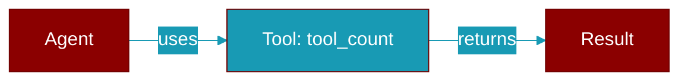

# tool_count

<div className="flex items-center gap-2">
  <Badge color="blue">Async</Badge>
  <Badge color="purple">Method</Badge>
</div>

> This is a method of the [**Agent**](../classes/Agent) class in the [**agent**](../modules/agent) module.

Get the number of tools



## Signature

```python
async def tool_count(&self) -> usize
```

### Returns

<ResponseField name="Returns" type="usize">
  The result of the operation.
</ResponseField>


---

## Related Documentation

<CardGroup cols={2}>
  <Card title="Tools Concept" icon="wrench" href="/docs/concepts/tools" />
  <Card title="Create Custom Tools" icon="plus" href="/docs/guides/tools/create-custom-tools" />
  <Card title="Tool Development" icon="code" href="/docs/tutorials/advanced-tool-development" />
</CardGroup>
