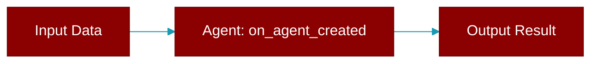

# on_agent_created

<div className="flex items-center gap-2">
  <Badge color="purple">Method</Badge>
</div>

> This is a method of the [**AgentPluginProtocol**](../classes/AgentPluginProtocol) class in the [**plugins**](../modules/plugins) module.

Called when agent is created



## Signature

```python
def on_agent_created(&self, _agent_name: &str) -> Result<(), String>
```

## Parameters

<ParamField query="_agent_name" type="&str" required={true}>
  No description available.
</ParamField>

### Returns

<ResponseField name="Returns" type="Result<(), String>">
  The result of the operation.
</ResponseField>


---

## Related Documentation

<CardGroup cols={2}>
  <Card title="Rust Agent" icon="robot" href="/docs/rust/agent" />
  <Card title="Rust Overview" icon="book-open" href="/docs/rust/overview" />
  <Card title="Rust Quickstart" icon="rocket" href="/docs/rust/quickstart" />
  <Card title="Rust Installation" icon="download" href="/docs/rust/installation" />
  <Card title="Rust Autonomy" icon="wand-magic-sparkles" href="/docs/rust/autonomy" />
</CardGroup>
