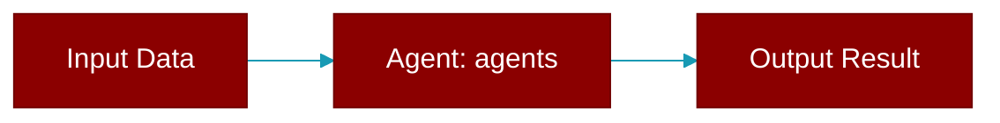

# agents

<div className="flex items-center gap-2">
  <Badge color="purple">Method</Badge>
</div>

> This is a method of the [**AutoAgents**](../classes/AutoAgents) class in the [**specialized**](../modules/specialized) module.

Get generated agents



## Signature

```python
def agents(&self) -> &[AutoAgentSpec]
```

### Returns

<ResponseField name="Returns" type="&[AutoAgentSpec]">
  The result of the operation.
</ResponseField>


---

## Related Documentation

<CardGroup cols={2}>
  <Card title="Rust Overview" icon="book-open" href="/docs/rust/overview" />
  <Card title="Rust Quickstart" icon="rocket" href="/docs/rust/quickstart" />
  <Card title="Rust Agent Guide" icon="robot" href="/docs/rust/agent" />
  <Card title="Rust Installation" icon="download" href="/docs/rust/installation" />
</CardGroup>
