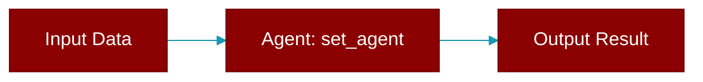

# set_agent

<div className="flex items-center gap-2">
  <Badge color="purple">Method</Badge>
</div>

> This is a method of the [**BotProtocol**](../classes/BotProtocol) class in the [**bots**](../modules/bots) module.

Set the agent that handles messages.



## Signature

```python
def set_agent(&mut self, agent: Arc<Agent>) -> ()
```

## Parameters

<ParamField query="agent" type="Arc&lt;Agent&gt;" required={true}>
  No description available.
</ParamField>

### Returns

<ResponseField name="Returns" type="()">
  The result of the operation.
</ResponseField>


---

## Related Documentation

<CardGroup cols={2}>
  <Card title="Rust Overview" icon="book-open" href="/docs/rust/overview" />
  <Card title="Rust Quickstart" icon="rocket" href="/docs/rust/quickstart" />
  <Card title="Rust Agent Guide" icon="robot" href="/docs/rust/agent" />
  <Card title="Rust Installation" icon="download" href="/docs/rust/installation" />
</CardGroup>
