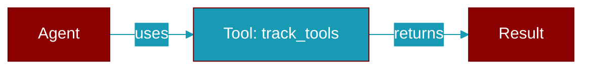

# track_tools

<div className="flex items-center gap-2">
  <Badge color="purple">Method</Badge>
</div>

> This is a method of the [**ContextManager**](../classes/ContextManager) class in the [**context**](../modules/context) module.

Estimate and track tools



## Signature

```python
def track_tools(&mut self, tools: &[serde_json::Value]) -> ()
```

## Parameters

<ParamField query="tools" type="&" required={true}>
  No description available.
</ParamField>

### Returns

<ResponseField name="Returns" type="()">
  The result of the operation.
</ResponseField>


---

## Related Documentation

<CardGroup cols={2}>
  <Card title="Rust Tools" icon="wrench" href="/docs/rust/tools" />
  <Card title="Rust Overview" icon="book-open" href="/docs/rust/overview" />
</CardGroup>
