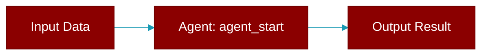

# agent_start

<div className="flex items-center gap-2">
  <Badge color="purple">Method</Badge>
</div>

> This is a method of the [**ContextTraceEmitter**](../classes/ContextTraceEmitter) class in the [**trace**](../modules/trace) module.

Emit agent start event.



## Signature

```python
def agent_start(&mut self, agent_id: &str, agent_name: &str, input: &str) -> ()
```

## Parameters

<ParamField query="agent_id" type="&str" required={true}>
  No description available.
</ParamField>

<ParamField query="agent_name" type="&str" required={true}>
  No description available.
</ParamField>

<ParamField query="input" type="&str" required={true}>
  No description available.
</ParamField>

### Returns

<ResponseField name="Returns" type="()">
  The result of the operation.
</ResponseField>


---

## Related Documentation

<CardGroup cols={2}>
  <Card title="Rust Overview" icon="book-open" href="/docs/rust/overview" />
  <Card title="Rust Quickstart" icon="rocket" href="/docs/rust/quickstart" />
  <Card title="Rust Agent Guide" icon="robot" href="/docs/rust/agent" />
  <Card title="Rust Installation" icon="download" href="/docs/rust/installation" />
</CardGroup>
