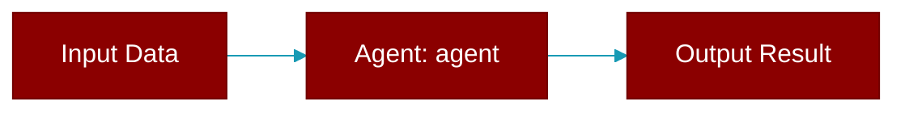

# agent

<div className="flex items-center gap-2">
  <Badge color="purple">Method</Badge>
</div>

> This is a method of the [**DisplayEvent**](../classes/DisplayEvent) class in the [**display_types**](../modules/display_types) module.

Set agent name



## Signature

```python
def agent(mut self, name: impl Into<String>) -> Self
```

## Parameters

<ParamField query="name" type="impl Into&lt;String&gt;" required={true}>
  No description available.
</ParamField>

### Returns

<ResponseField name="Returns" type="Self">
  The result of the operation.
</ResponseField>


---

## Related Documentation

<CardGroup cols={2}>
  <Card title="Rust Overview" icon="book-open" href="/docs/rust/overview" />
  <Card title="Rust Quickstart" icon="rocket" href="/docs/rust/quickstart" />
  <Card title="Rust Agent Guide" icon="robot" href="/docs/rust/agent" />
  <Card title="Rust Installation" icon="download" href="/docs/rust/installation" />
</CardGroup>
