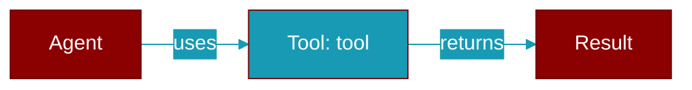

# tool

<div className="flex items-center gap-2">
  <Badge color="purple">Method</Badge>
</div>

> This is a method of the [**DisplayEvent**](../classes/DisplayEvent) class in the [**display**](../modules/display) module.

Set tool name



## Signature

```python
def tool(mut self, name: impl Into<String>) -> Self
```

## Parameters

<ParamField query="name" type="impl Into&lt;String&gt;" required={true}>
  No description available.
</ParamField>

### Returns

<ResponseField name="Returns" type="Self">
  The result of the operation.
</ResponseField>


---

## Related Documentation

<CardGroup cols={2}>
  <Card title="Rust Tools" icon="wrench" href="/docs/rust/tools" />
  <Card title="Rust Code Execution" icon="terminal" href="/docs/rust/code-execution" />
  <Card title="Rust Web Search" icon="search" href="/docs/rust/web-search" />
</CardGroup>
