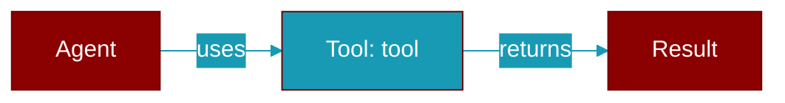

# tool

<div className="flex items-center gap-2">
  <Badge color="purple">Method</Badge>
</div>

> This is a method of the [**Error**](../classes/Error) class in the [**error**](../modules/error) module.

Create a tool error



## Signature

```python
def tool(msg: impl Into<String>) -> Self
```

## Parameters

<ParamField query="msg" type="impl Into&lt;String&gt;" required={true}>
  No description available.
</ParamField>

### Returns

<ResponseField name="Returns" type="Self">
  The result of the operation.
</ResponseField>


---

## Related Documentation

<CardGroup cols={2}>
  <Card title="Rust Tools" icon="wrench" href="/docs/rust/tools" />
  <Card title="Rust Overview" icon="book-open" href="/docs/rust/overview" />
</CardGroup>
