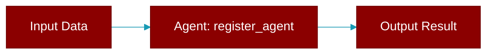

# register_agent

<div className="flex items-center gap-2">
  <Badge color="purple">Method</Badge>
</div>

> This is a method of the [**GatewayProtocol**](../classes/GatewayProtocol) class in the [**gateway**](../modules/gateway) module.

Register an agent with the gateway.



## Signature

```python
def register_agent(&mut self, agent: Arc<Agent>, agent_id: Option<String>) -> String
```

## Parameters

<ParamField query="agent" type="Arc&lt;Agent&gt;" required={true}>
  No description available.
</ParamField>

<ParamField query="agent_id" type="Option&lt;String&gt;" required={true}>
  No description available.
</ParamField>

### Returns

<ResponseField name="Returns" type="String">
  The result of the operation.
</ResponseField>


---

## Related Documentation

<CardGroup cols={2}>
  <Card title="Agents Concept" icon="robot" href="/docs/concepts/agents" />
  <Card title="Single Agent Guide" icon="book-open" href="/docs/guides/single-agent" />
  <Card title="Multi-Agent Guide" icon="users" href="/docs/guides/multi-agent" />
  <Card title="Agent Configuration" icon="gear" href="/docs/configuration/agent-config" />
  <Card title="Auto Agents" icon="wand-magic-sparkles" href="/docs/features/autoagents" />
</CardGroup>
