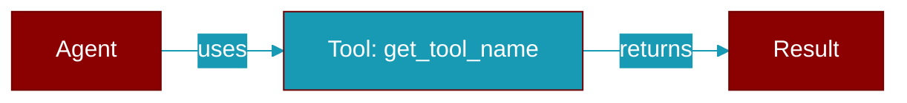

# get_tool_name

<div className="flex items-center gap-2">
  <Badge color="purple">Method</Badge>
</div>

> This is a method of the [**Handoff**](../classes/Handoff) class in the [**handoff**](../modules/handoff) module.

Get the tool name for this handoff



## Signature

```python
def get_tool_name(&self) -> String
```

### Returns

<ResponseField name="Returns" type="String">
  The result of the operation.
</ResponseField>


---

## Related Documentation

<CardGroup cols={2}>
  <Card title="Rust Tools" icon="wrench" href="/docs/rust/tools" />
  <Card title="Rust Overview" icon="book-open" href="/docs/rust/overview" />
</CardGroup>
