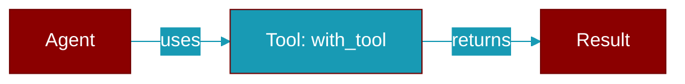

# with_tool

<div className="flex items-center gap-2">
  <Badge color="purple">Method</Badge>
</div>

> This is a method of the [**HookInput**](../classes/HookInput) class in the [**hooks**](../modules/hooks) module.

Set tool info



## Signature

```python
def with_tool(mut self, name: impl Into<String>, args: serde_json::Value) -> Self
```

## Parameters

<ParamField query="name" type="impl Into&lt;String&gt;" required={true}>
  No description available.
</ParamField>

<ParamField query="args" type="serde_json::Value" required={true}>
  No description available.
</ParamField>

### Returns

<ResponseField name="Returns" type="Self">
  The result of the operation.
</ResponseField>


---

## Related Documentation

<CardGroup cols={2}>
  <Card title="Tools Concept" icon="wrench" href="/docs/concepts/tools" />
  <Card title="Create Custom Tools" icon="plus" href="/docs/guides/tools/create-custom-tools" />
  <Card title="Tool Development" icon="code" href="/docs/tutorials/advanced-tool-development" />
</CardGroup>
