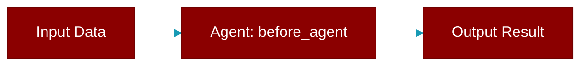

# before_agent

<div className="flex items-center gap-2">
  <Badge color="purple">Method</Badge>
</div>

> This is a method of the [**HookPluginProtocol**](../classes/HookPluginProtocol) class in the [**plugins**](../modules/plugins) module.

Called before agent execution



## Signature

```python
def before_agent(&self, _agent_name: &str, _input: &str) -> Result<Option<String>, String>
```

## Parameters

<ParamField query="_agent_name" type="&str" required={true}>
  No description available.
</ParamField>

<ParamField query="_input" type="&str" required={true}>
  No description available.
</ParamField>

### Returns

<ResponseField name="Returns" type="Result<Option<String>, String>">
  The result of the operation.
</ResponseField>


---

## Related Documentation

<CardGroup cols={2}>
  <Card title="Rust Overview" icon="book-open" href="/docs/rust/overview" />
  <Card title="Rust Quickstart" icon="rocket" href="/docs/rust/quickstart" />
  <Card title="Rust Agent Guide" icon="robot" href="/docs/rust/agent" />
  <Card title="Rust Installation" icon="download" href="/docs/rust/installation" />
</CardGroup>
