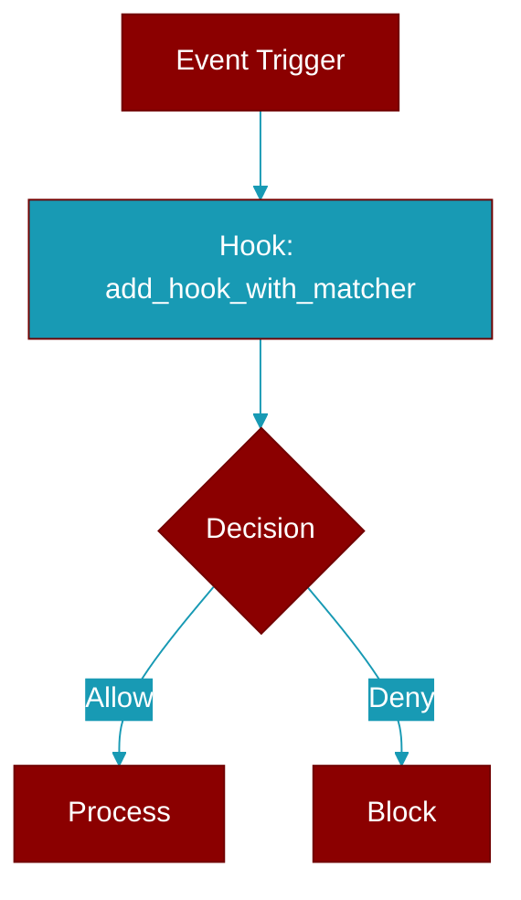

# add_hook_with_matcher

<div className="flex items-center gap-2">
  <Badge color="purple">Method</Badge>
</div>

> This is a method of the [**HookRegistry**](../classes/HookRegistry) class in the [**hooks**](../modules/hooks) module.

Add a hook with matcher



## Signature

```python
def add_hook_with_matcher(
        &mut self,
        event: HookEvent,
        matcher: impl Into<String>,
        func: impl Fn(&HookInput) -> HookResult + Send + Sync + 'static,
    ) -> &mut Self
```

## Parameters

<ParamField query="event" type="HookEvent" required={true}>
  No description available.
</ParamField>

<ParamField query="matcher" type="impl Into&lt;String&gt;" required={true}>
  No description available.
</ParamField>

<ParamField query="func" type="impl Fn(&HookInput" required={true}>
  No description available.
</ParamField>

### Returns

<ResponseField name="Returns" type="HookResult + Send + Sync + 'static,
    ) -> &mut Self">
  The result of the operation.
</ResponseField>


---

## Related Documentation

<CardGroup cols={2}>
  <Card title="Rust Hooks" icon="anchor" href="/docs/rust/hooks" />
  <Card title="Rust Events" icon="bolt" href="/docs/rust/events" />
  <Card title="Rust Callbacks" icon="phone" href="/docs/rust/callbacks" />
</CardGroup>
