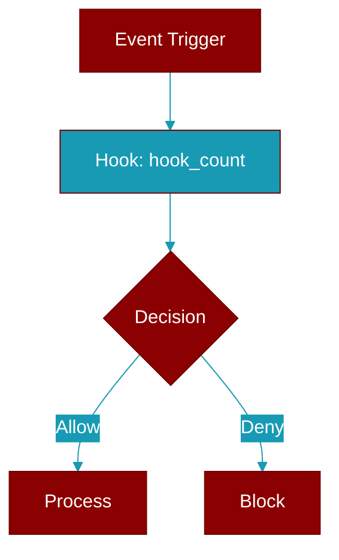

# hook_count

<div className="flex items-center gap-2">
  <Badge color="purple">Method</Badge>
</div>

> This is a method of the [**HookRegistry**](../classes/HookRegistry) class in the [**hooks**](../modules/hooks) module.

Get hook count for an event



## Signature

```python
def hook_count(&self, event: HookEvent) -> usize
```

## Parameters

<ParamField query="event" type="HookEvent" required={true}>
  No description available.
</ParamField>

### Returns

<ResponseField name="Returns" type="usize">
  The result of the operation.
</ResponseField>


---

## Related Documentation

<CardGroup cols={2}>
  <Card title="Rust Hooks" icon="anchor" href="/docs/rust/hooks" />
</CardGroup>
