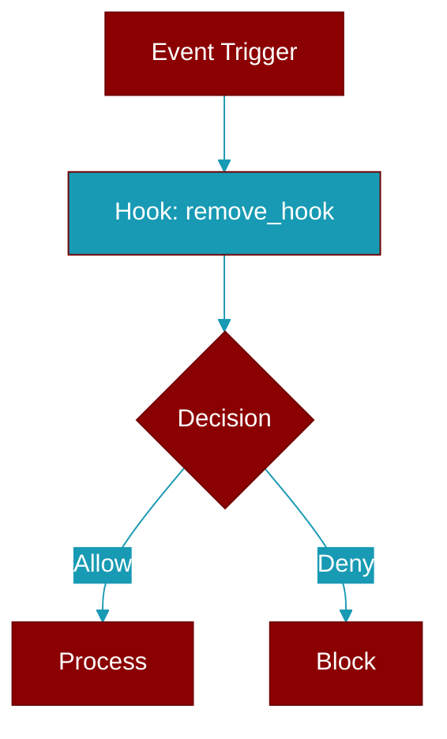

# remove_hook

<div className="flex items-center gap-2">
  <Badge color="purple">Method</Badge>
</div>

> This is a method of the [**HookRegistry**](../classes/HookRegistry) class in the [**hooks**](../modules/hooks) module.

Remove a hook by ID



## Signature

```python
def remove_hook(&mut self, id: &str) -> bool
```

## Parameters

<ParamField query="id" type="&str" required={true}>
  No description available.
</ParamField>

### Returns

<ResponseField name="Returns" type="bool">
  The result of the operation.
</ResponseField>


---

## Related Documentation

<CardGroup cols={2}>
  <Card title="Rust Hooks" icon="anchor" href="/docs/rust/hooks" />
</CardGroup>
