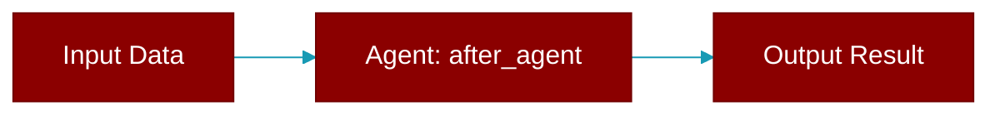

# after_agent

<div className="flex items-center gap-2">
  <Badge color="purple">Method</Badge>
</div>

> This is a method of the [**HookRunner**](../classes/HookRunner) class in the [**hooks**](../modules/hooks) module.

Run after-agent hooks



## Signature

```python
def after_agent(
        &self,
        session_id: &str,
        agent_name: &str,
        response: &str,
    ) -> Result<HookResult>
```

## Parameters

<ParamField query="session_id" type="&str" required={true}>
  No description available.
</ParamField>

<ParamField query="agent_name" type="&str" required={true}>
  No description available.
</ParamField>

<ParamField query="response" type="&str" required={true}>
  No description available.
</ParamField>

### Returns

<ResponseField name="Returns" type="Result<HookResult>">
  The result of the operation.
</ResponseField>


---

## Related Documentation

<CardGroup cols={2}>
  <Card title="Rust Agent" icon="robot" href="/docs/rust/agent" />
  <Card title="Rust Overview" icon="book-open" href="/docs/rust/overview" />
  <Card title="Rust Quickstart" icon="rocket" href="/docs/rust/quickstart" />
  <Card title="Rust Installation" icon="download" href="/docs/rust/installation" />
  <Card title="Rust Autonomy" icon="wand-magic-sparkles" href="/docs/rust/autonomy" />
</CardGroup>
