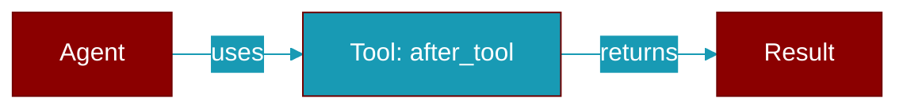

# after_tool

<div className="flex items-center gap-2">
  <Badge color="purple">Method</Badge>
</div>

> This is a method of the [**HookRunner**](../classes/HookRunner) class in the [**hooks**](../modules/hooks) module.

Run after-tool hooks



## Signature

```python
def after_tool(
        &self,
        session_id: &str,
        tool_name: &str,
        result: serde_json::Value,
    ) -> Result<HookResult>
```

## Parameters

<ParamField query="session_id" type="&str" required={true}>
  No description available.
</ParamField>

<ParamField query="tool_name" type="&str" required={true}>
  No description available.
</ParamField>

<ParamField query="result" type="serde_json::Value" required={true}>
  No description available.
</ParamField>

### Returns

<ResponseField name="Returns" type="Result<HookResult>">
  The result of the operation.
</ResponseField>


---

## Related Documentation

<CardGroup cols={2}>
  <Card title="Tools Concept" icon="wrench" href="/docs/concepts/tools" />
  <Card title="Create Custom Tools" icon="plus" href="/docs/guides/tools/create-custom-tools" />
  <Card title="Tool Development" icon="code" href="/docs/tutorials/advanced-tool-development" />
</CardGroup>
