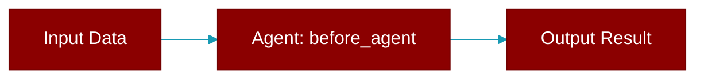

# before_agent

<div className="flex items-center gap-2">
  <Badge color="purple">Method</Badge>
</div>

> This is a method of the [**HookRunner**](../classes/HookRunner) class in the [**hooks**](../modules/hooks) module.

Run before-agent hooks



## Signature

```python
def before_agent(
        &self,
        session_id: &str,
        agent_name: &str,
        message: &str,
    ) -> Result<HookResult>
```

## Parameters

<ParamField query="session_id" type="&str" required={true}>
  No description available.
</ParamField>

<ParamField query="agent_name" type="&str" required={true}>
  No description available.
</ParamField>

<ParamField query="message" type="&str" required={true}>
  No description available.
</ParamField>

### Returns

<ResponseField name="Returns" type="Result<HookResult>">
  The result of the operation.
</ResponseField>


---

## Related Documentation

<CardGroup cols={2}>
  <Card title="Agents Concept" icon="robot" href="/docs/concepts/agents" />
  <Card title="Single Agent Guide" icon="book-open" href="/docs/guides/single-agent" />
  <Card title="Multi-Agent Guide" icon="users" href="/docs/guides/multi-agent" />
  <Card title="Agent Configuration" icon="gear" href="/docs/configuration/agent-config" />
  <Card title="Auto Agents" icon="wand-magic-sparkles" href="/docs/features/autoagents" />
</CardGroup>
