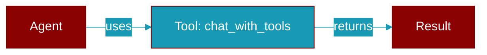

# chat_with_tools

<div className="flex items-center gap-2">
  <Badge color="blue">Async</Badge>
  <Badge color="purple">Method</Badge>
</div>

> This is a method of the [**LlmProtocol**](../classes/LlmProtocol) class in the [**protocols**](../modules/protocols) module.

Chat with tools



## Signature

```python
async def chat_with_tools(
        &self,
        messages: &[LlmMessage],
        tools: &[ToolSchema],
    ) -> Result<LlmResponse>
```

## Parameters

<ParamField query="messages" type="&" required={true}>
  No description available.
</ParamField>

<ParamField query="tools" type="&" required={true}>
  No description available.
</ParamField>

### Returns

<ResponseField name="Returns" type="Result<LlmResponse>">
  The result of the operation.
</ResponseField>


---

## Related Documentation

<CardGroup cols={2}>
  <Card title="Tools Concept" icon="wrench" href="/docs/concepts/tools" />
  <Card title="Create Custom Tools" icon="plus" href="/docs/guides/tools/create-custom-tools" />
  <Card title="Tool Development" icon="code" href="/docs/tutorials/advanced-tool-development" />
  <Card title="Chat Feature" icon="comments" href="/docs/features/chat" />
  <Card title="Conversation Stores" icon="database" href="/docs/databases/overview" />
</CardGroup>
