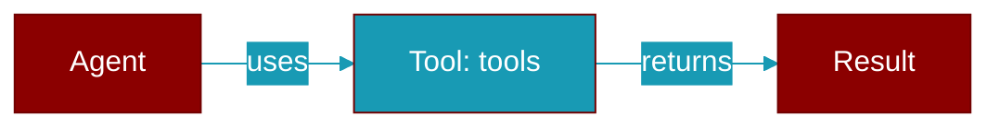

# tools

<div className="flex items-center gap-2">
  <Badge color="purple">Method</Badge>
</div>

> This is a method of the [**MCPServer**](../classes/MCPServer) class in the [**mcp**](../modules/mcp) module.

Get registered tools



## Signature

```python
def tools(&self) -> &[MCPTool]
```

### Returns

<ResponseField name="Returns" type="&[MCPTool]">
  The result of the operation.
</ResponseField>


---

## Related Documentation

<CardGroup cols={2}>
  <Card title="Rust Tools" icon="wrench" href="/docs/rust/tools" />
  <Card title="Rust Overview" icon="book-open" href="/docs/rust/overview" />
</CardGroup>
