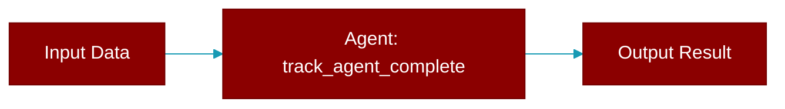

# track_agent_complete

<div className="flex items-center gap-2">
  <Badge color="purple">Method</Badge>
</div>

> This is a method of the [**MinimalTelemetry**](../classes/MinimalTelemetry) class in the [**telemetry_funcs**](../modules/telemetry_funcs) module.

Track agent completion



## Signature

```python
def track_agent_complete(&self, agent_name: &str, duration_ms: u64) -> ()
```

## Parameters

<ParamField query="agent_name" type="&str" required={true}>
  No description available.
</ParamField>

<ParamField query="duration_ms" type="u64" required={true}>
  No description available.
</ParamField>

### Returns

<ResponseField name="Returns" type="()">
  The result of the operation.
</ResponseField>


---

## Related Documentation

<CardGroup cols={2}>
  <Card title="Agents Concept" icon="robot" href="/docs/concepts/agents" />
  <Card title="Single Agent Guide" icon="book-open" href="/docs/guides/single-agent" />
  <Card title="Multi-Agent Guide" icon="users" href="/docs/guides/multi-agent" />
  <Card title="Agent Configuration" icon="gear" href="/docs/configuration/agent-config" />
  <Card title="Auto Agents" icon="wand-magic-sparkles" href="/docs/features/autoagents" />
</CardGroup>
